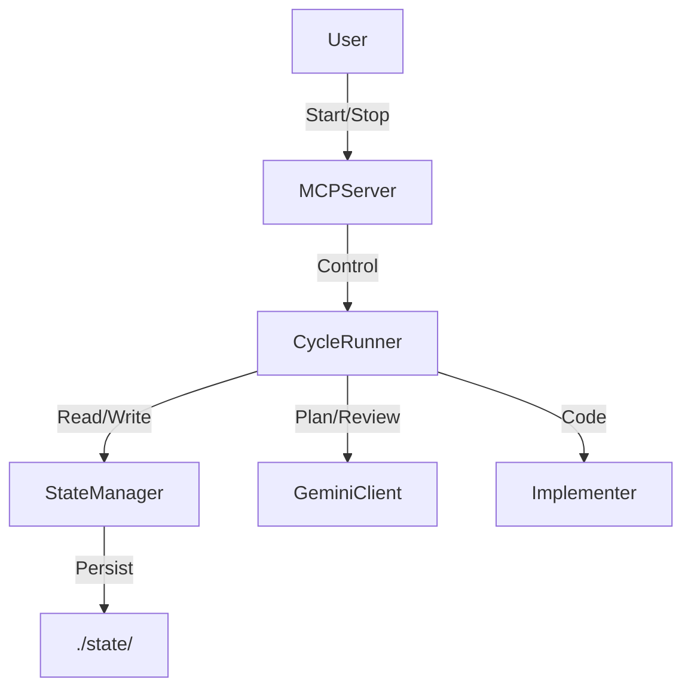

<!-- conductor-bridge: model=gemini-3-pro-preview extensions=conductor -->

# Conductor Bridge MVP Specification

## 1. Overview
The **Conductor Bridge MVP** is an orchestration hub designed to connect high-level planning agents (Gemini Conductor) with implementation agents (Codex, Claude) via the Model Context Protocol (MCP). It manages the lifecycle of a software development task through a continuous loop of planning, implementation, and review.

## 2. System Architecture

The system consists of four primary components:

1.  **MCP Server (`server.py`)**: Exposes system state and control mechanisms to external agents via JSON-RPC 2.0 over HTTP (default port 8765) or stdio.
2.  **Cycle Runner (`runner.py`)**: Executes the core business logic loop (`Plan -> Implement -> Review`).
3.  **State Manager (`state.py`)**: Handles atomic, thread-safe persistence of system state and artifacts.
4.  **Adapters**:
    *   `GeminiClient`: Interface to Gemini CLI for planning/review.
    *   `Implementer`: Abstract base class for coding agents (Codex, Claude, Simulation).

### Data Flow


## 3. State Machine Specification

The system operates as a finite state machine (FSM) with the following canonical states.

### State Object Schema
```json
{
  "phase": "string (enum)",
  "paused": "boolean",
  "cycle_count": "integer",
  "last_updated": "ISO-8601 string",
  "current_task": "string | null",
  "error": "string | null"
}
```

### Lifecycle Phases
The `phase` field transitions as follows:

1.  **`planning`** (Start)
    *   **Entry Condition**: System start or completion of previous cycle.
    *   **Action**: Generate `artifacts/plan.md`.
    *   **Success Transition**: `implementing`.
    *   **Failure Behavior**: Log error, remain in `planning` (or pause if critical).

2.  **`implementing`**
    *   **Entry Condition**: Successful generation of plan.
    *   **Action**: Invoke selected Implementer (Codex/Claude) to execute plan and generate `artifacts/handoff.md`.
    *   **Success Transition**: `awaiting_review`.
    *   **Failure Behavior**: Log error, retry or pause.

3.  **`awaiting_review`**
    *   **Entry Condition**: Successful implementation handoff.
    *   **Action**: Generate `artifacts/review.md` evaluating the implementation against the plan.
    *   **Success Transition**: `planning` (and Increment `cycle_count`).

### Control Flags
*   **`paused`**: If `true`, the `CycleRunner` MUST abort or skip the next cycle iteration.

## 4. Interface Specification (MCP Tools)

The server must expose the following MCP tools. All tools return JSON.

| Tool Name | Arguments | Expected Behavior |
|-----------|-----------|-------------------|
| `ping` | None | Returns `{"status": "ok"}`. Used for health checks. |
| `get_state` | None | Returns the current `BridgeState` object. |
| `set_state` | `partial_update` (object) | Updates state atomically. Returns new state. |
| `append_event` | `type` (string), `payload` (object) | Appends to `events.jsonl`. Returns created event. |
| `get_artifacts` | None | Lists available artifact filenames in `state/artifacts/`. |
| `write_artifact` | `name` (string), `content` (string) | Writes file to `state/artifacts/`. Enforces valid filenames. |
| `run_cycle` | `implementer` (string) | Triggers a synchronous cycle run. Returns cycle results. |
| `pause` | None | Sets `paused=true`. |
| `resume` | None | Sets `paused=false`. |

## 5. Data Persistence Requirements

### File Structure
*   **`state/state.json`**: Stores the canonical `BridgeState`.
    *   *Constraint*: Must use atomic writes (write-temp-move) to prevent corruption.
    *   *Constraint*: Must use file locking (Win32 `msvcrt` / POSIX `fcntl`) to prevent race conditions between Server and Runner processes.
*   **`state/events.jsonl`**: Append-only log of system events.
*   **`state/artifacts/*.md`**: Markdown files generated during the cycle (`plan.md`, `handoff.md`, `review.md`).

### Concurrency
*   The **Server** runs in a separate process/thread from the **Runner**.
*   Both must respect file locks on `state.json` to ensure consistency.

## 6. Test Plan & Acceptance Criteria

### 6.1 Unit Tests (`tests/test_state.py`)
*   **Atomic Writes**: Verify that interrupting a write does not corrupt `state.json`.
*   **Locking**: Verify that two processes cannot write to `state.json` simultaneously (one should block or fail).
*   **Schema Validation**: Verify `BridgeState` rejects invalid types (e.g., string for `cycle_count`).

### 6.2 Integration Tests (`tests/test_mcp.py`)
*   **Tool Availability**: `curl` request to `tools/list` returns all specified tools.
*   **State Mutation**: calling `set_state` via MCP reflects in `get_state` immediately.
*   **Artifact I/O**: `write_artifact` via MCP creates a file readable by `read_artifact`.

### 6.3 End-to-End Simulation (`tests/test_runner.py`)
*   **Full Cycle**:
    1.  Initialize with `cycle_count=0`.
    2.  Run `CycleRunner` with `implementer="simulate"`.
    3.  **Verify**:
        *   `cycle_count` becomes `1`.
        *   `state/artifacts/plan.md` exists and contains "Plan".
        *   `state/artifacts/handoff.md` exists.
        *   `state/artifacts/review.md` exists.
        *   `events.jsonl` contains `phase_start` and `phase_complete` events for all 3 phases.

### 6.4 Failure Scenarios
*   **Pause**: If `paused=true`, `run_cycle` returns immediately with `skipped=true`.
*   **Missing Implementer**: If requested implementer is missing, system falls back to available one or simulates (logging the fallback).
